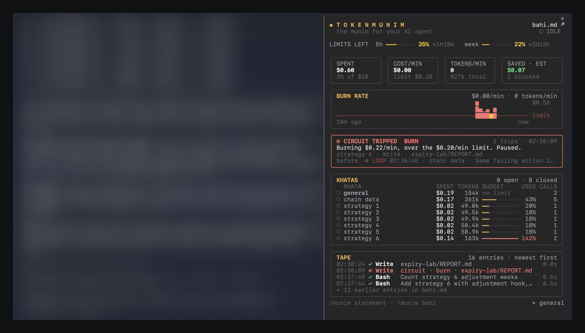
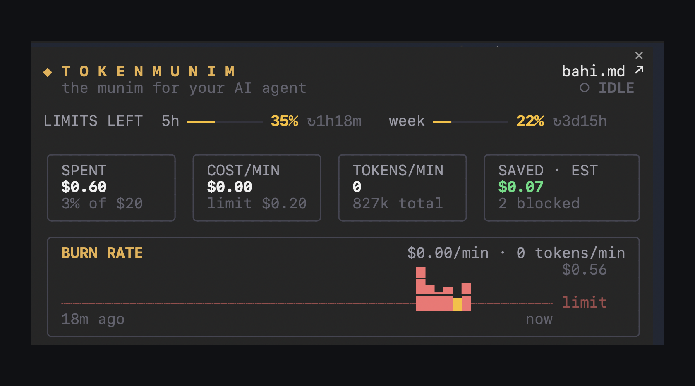

# TokenMunim

[](https://github.com/PiyushSinha-9/tokenmunim/actions/workflows/ci.yml)  

**A munim for your AI agent.** TokenMunim is a [Claude Code mod](https://code.claude.com/docs/en/plugins/mods/overview) that keeps a ledger of everything an agent does, books what it spends to the task it spent it on, and trips a circuit breaker when the agent starts wasting money.

<p align="center">
  
</p>

## What "munim" means

A **munim** (मुनीम) is the bookkeeper of a traditional Indian shop or business. Every rupee that comes in or goes out, the munim writes down in the ledger, so the owner always knows where the money went. TokenMunim does the same job for an AI agent's tokens.

The pane uses the munim's own words:

| Word | What it means | In TokenMunim |
|---|---|---|
| **Munim** (मुनीम) | The bookkeeper who records every transaction | The mod itself |
| **Bahi** (बही) | The ledger book the munim writes in | The live tape, and the full ledger file `bahi.md` |
| **Khata** (खाता) | One account inside the bahi, kept for one customer or purpose | One account per task, with its own budget |

## What it does

**Khatas.** Each task gets its own account, a khata, with an optional budget. The agent opens one with the `open_khata` tool when it starts a task, so an overnight run of twenty tasks becomes twenty lines of cost and tokens instead of one big number.

**Bahi.** Every tool call goes on a live tape: what it was for, how long it took, and whether it worked. The full ledger is written to `.tokenmunim/bahi-<session>.md` in your project, one click away from the pane (`bahi.md ↗`). The folder ignores itself in git.

**Circuit breaker.** TokenMunim stops a call before it runs when:

| Circuit | Trips when | The agent is told |
|---|---|---|
| Loop | The same action fails 3 times in a row | Stop retrying, read the error, change the approach |
| Burn | Spend over the last two minutes passes the rate limit | Pause and work leaner |
| Budget | A khata spends more than its budget | Leave this task and move to the next one |
| Session | The session spends more than its budget | Stop and report |

A trip blocks one call and says why, so the agent can recover. It never ends the session, and it never blocks the tools an agent needs to get itself out of a halt.

**The pane.** How much of your 5 hour and weekly limits is left, spend, cost and tokens per minute, a burn chart with the limit drawn in, the latest circuit trip, your khatas and the tape. Every section sits in a fixed frame, so a ten hour session looks as calm as a ten minute one.

<p align="center">
  
  
</p>

## Install

Needs Claude Code 2.1.287 or later.

```
claude plugin marketplace add PiyushSinha-9/tokenmunim
claude plugin install tokenmunim@tokenmunim
```

The installer may say the four settings aren't set yet. They all have defaults, so you can skip that. Open a session and run `/munim`. In a terminal 144 columns or wider the pane docks beside the transcript on its own.

## Use it

Ask for khatas in your prompt:

> Migrate all twelve services to the new config. Open a khata per service with a $0.50 budget.

| Command | What it does |
|---|---|
| `/munim` | Opens the pane |
| `/munim statement` | Prints the session's statement |
| `/munim bahi` | Writes the ledger file and opens it |
| `/munim khata <name>` | Opens a khata by hand |
| `/munim close` | Closes the open khata |
| `/munim reset` | Clears this session's book |

Scripts and agents that can't see the tool can open a khata with a shell line, `munim:khata <name> <budget>`. TokenMunim answers it, and the shell never runs it.

## Settings

Change them in `/plugin`, under TokenMunim's configuration.

| Setting | Default | Meaning |
|---|---|---|
| Budget per khata | $1 | A khata that spends this much is halted |
| Session budget | $20 | Every call is blocked once the session spends this much |
| Loop limit | 3 | Identical failures before a retry is blocked |
| Burn limit | $2 a minute | Measured over two minutes; pauses the agent once |

## Try it

[`examples/flaky-feed`](examples/flaky-feed) is a feed that answers "busy, retry" for one item forever, the shape most agent loops take. Ask Claude to fetch from it and retry when it is busy, and watch the loop circuit stop the retries.

## How it works

TokenMunim hooks five events: every tool call (check, run, record), every model reply (book its tokens and cost), the end of each turn (save the ledger), its slash command, and the pane's draw. The rules are pure functions over one immutable book, so every one is tested without a live session. [docs/DESIGN.md](docs/DESIGN.md) covers the design, the trade-offs, and the bugs TokenMunim found in itself.

## Develop

```
claude plugin validate ./plugin
claude plugin test ./plugin
```

## License

MIT
