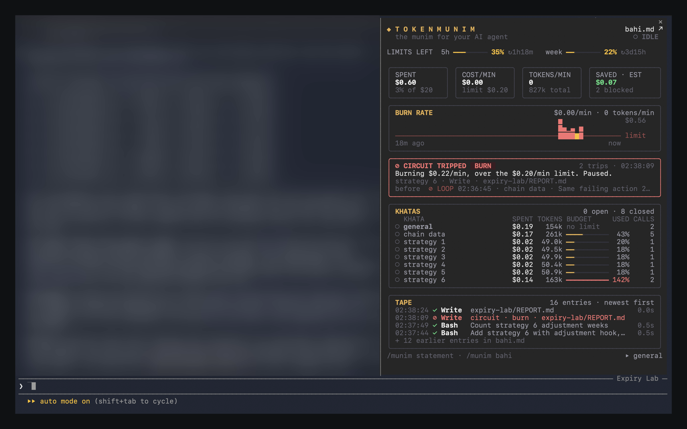
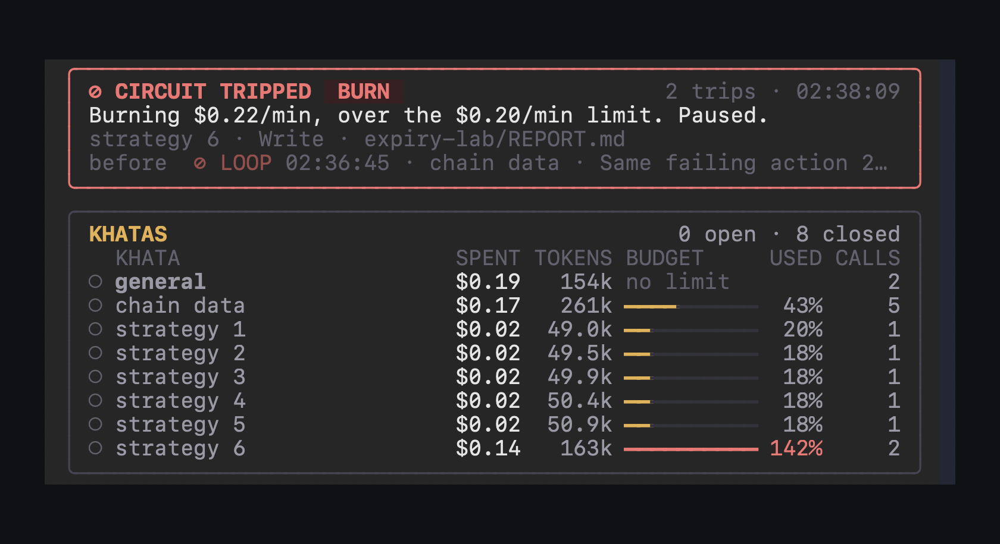

# TokenMunim

[](https://github.com/PiyushSinha-9/tokenmunim/actions/workflows/ci.yml)  

**Cost control for AI agents.** TokenMunim is a [Claude Code mod](https://code.claude.com/docs/en/plugins/mods/overview) that gives every task its own budget, as a share of your plan or in dollars, keeps a live ledger of every step your agent takes, and trips a circuit breaker the moment the agent starts wasting your limits.

<p align="center">
  
</p>

## Why

Agents now run for hours with nobody watching. When one gets stuck it rarely crashes: it retries, rereads, rewrites, and keeps spending. On a Pro or Max plan that spending is your 5 hour and weekly limit, and the plan shows only the total: not which session or task used it, and nothing stops it while it happens.

TokenMunim answers three questions while the agent works, not after:

1. **Where is my limit going?** Each task's share of your week, and its tokens.
2. **What did the agent actually do?** A complete, readable record of every call.
3. **When should it stop?** Rules that block a call before it runs.

## What it does

**Budgets as a share of your plan.** The agent starts a task with the `start_task` tool, and everything it does from then on is counted against that task: its share of your plan, tokens, calls and failures. A budget reads the way you think about your plan: `2% week`, `10% 5h`, or dollars, `$0.50`. An overnight run of twenty tasks becomes twenty lines on a ledger instead of one big number.

**Only its own usage counts.** A task's share is measured from the task's own work, so other sessions using the same plan at the same time never eat into its budget. A share is never more than what is left of its window.

**It learns what 1% is worth.** Claude Code reports how much of each window your account has used, never how big the window is. So TokenMunim watches the weekly and 5 hour percent move while the session works, leaves out the stretches it did not watch, when another session could have been using the plan, and keeps the rate it learned for your next session. Tokens are weighed the way they are priced, because a cached token costs a tenth of a fresh one and an output token five times as much, so a raw token count would mislead. The 5 hour rate usually comes within minutes. The week moves slowly, so its rate can take a long session, and is remembered from then on. Until a rate is learned the dashboard shows tokens, and share budgets start counting once it is.

**A live ledger.** Every tool call is recorded as it happens: what it was for, how long it took, and whether it worked. The full ledger is written to `.tokenmunim/ledger-<session>.md` in your project, one click away from the pane. The folder ignores itself in git.

**A circuit breaker.** TokenMunim stops a call before it runs when:

| Circuit | Trips when | The agent is told |
|---|---|---|
| Loop | The same action fails 3 times in a row | Stop retrying, read the error, change the approach |
| Burn | Spend over the last two minutes passes the rate limit | Pause and work leaner |
| Budget | A task uses its budget | Leave this task and move to the next one |
| Session | The session uses its budget | Stop and report |

A trip blocks one call and says why, so the agent can recover. It never ends the session, and it never blocks the tools an agent needs to get itself unstuck.

**Per agent accounting.** Every reply is booked to the loop that made it, the main agent or a subagent, with its own tokens, cost, steps and cache hit rate. When a run fans out, you can see which subagent did the spending.

**Plan limits and runway.** How much of your 5 hour and weekly limits is left, and whether the last twenty minutes' pace lasts until the reset: `✓ lasts`, or `⚠ out in 42m` while there is still time to slow down.

**Token mix.** Where the tokens went: cache reads, fresh input, cache writes and output, with the cache hit rate that decides what a long session really costs.

## The pane

A dashboard that docks beside the transcript.

| Tab | What it shows |
|---|---|
| **Overview** | This session's share of the week and of the 5 hour window, plan limits and runway, tokens per minute, calls stopped, the burn chart, the token mix, tasks, recent activity and alerts |
| **Tasks** | Every task with its share of the week, tokens, budget bar and calls. `›` shows that task's calls |
| **Activity** | Every call, newest first, or only one task's after you drill in. `›` opens a call's details |
| **Alerts** | Everything the circuit breaker stopped, and what was done about it |
| **Agents** | The main agent and each subagent, with their model, steps, tokens, cost and cache hit rate |

* **Your share, on the limit bars.** Each limit bar marks this session's slice in white, right where it came out of what was left.
* **Alerts wait at the end.** The Alerts section stays folded behind a red `● 1 new` badge until you open it, counting each halted task once.
* **Act on an alert from the pane.** The alert has buttons: `+0.5% budget` gives a halted task more room, `Allow once` lets the next call through, `Skip task` moves the agent on. Each choice is recorded on the alert.
* **Fold any section** by clicking its title, and click again to open it. A section you open stays open: when room runs short the pane folds the others, never yours. From the keyboard: `/munim fold activity`, `/munim unfold burn`.
* **Fits any width.** Columns drop out in a fixed order as the pane narrows, tabs shorten, and charts stretch or shrink, so nothing wraps or spills.
* **Never floods.** Every list sits in a fixed frame. The overview fits itself to the pane's height, and older rows live in the ledger file.

<p align="center">
  
  
</p>

## Install

Needs Claude Code 2.1.287 or later.

```
claude plugin marketplace add PiyushSinha-9/tokenmunim
claude plugin install tokenmunim@tokenmunim
```

The installer may say the settings aren't set yet. They all have defaults, so you can skip that.

TokenMunim protects every session from the start, in the background, and shows nothing until you ask. Run `/munim` and a single **TokenMunim** button appears at the end of the line under the prompt, for that session only. Click it to open the dashboard. While the dashboard is open the button shows a ✕, and clicking it again closes it.

## Use it

Ask for tasks in your prompt:

> Migrate all twelve services to the new config. Start a task per service with 1% of my week each.

| Command | What it does |
|---|---|
| `/munim` | Shows the TokenMunim button under the prompt, for this session |
| `/munim open` / `/munim close` | Opens or closes the dashboard, like the button |
| `/munim off` | Hides the button and the dashboard; protection carries on |
| `/munim statement` | Prints the session's statement |
| `/munim ledger` | Writes the ledger file and opens it |
| `/munim tab <name>` | Switches to `overview`, `tasks`, `activity`, `alerts` or `agents` |
| `/munim fold <section>` | Folds `burn`, `mix`, `tasks` or `activity`; `/munim unfold <section>` opens it |
| `/munim task <name>` | Starts a task by hand |
| `/munim end` | Ends the current task |
| `/munim reset` | Clears this session's ledger |

Scripts and agents that can't see the tool can start a task with a shell line, `munim:task <name> <budget>` such as `munim:task review 2% week`, and end it with `munim:end`. TokenMunim answers these itself; the shell never runs them.

## Settings

Change them in `/plugin`, under TokenMunim's configuration.

| Setting | Default | Meaning |
|---|---|---|
| Budget per task | 1% of the week | A task that uses this much is halted. A share like `10% 5h`, or dollars like `$1` |
| Session budget | 20% of the week | Every call is blocked once this session has used this much of the week, counting only its own usage |
| Loop limit | 3 | Identical failures before a retry is blocked |
| Burn limit | $2 a minute | Measured over two minutes; pauses the agent once |
| Open the dashboard when a session starts | Off | Turn it on to see the dashboard without running `/munim` |

On an account without plan limits, such as an API key, a share budget counts as dollars instead: $1 a task and $20 a session, unless you set dollars yourself.

## What it costs

TokenMunim runs inside Claude Code, on your machine. It never calls a model itself, and nothing it records leaves your machine.

* **No extra model calls.** Checking a call, recording it and drawing the pane all happen locally, in milliseconds, without using tokens.
* **One tool call per task.** Starting a task is a tool call the agent makes, so it costs one small step. In sessions that load tools on demand, the first task also costs one lookup to load the tool.
* **How to avoid even that.** Ask Claude to start each task in the same reply as its first command, so it adds no step of its own. Or skip tasks entirely: work then counts toward the general task, and every circuit except the per task budget still protects you.

## Try it

[`examples/flaky-feed`](examples/flaky-feed) is a feed that answers "busy, retry" for one item forever, the shape most agent loops take. Ask Claude to fetch from it and retry when it is busy, and watch the loop circuit stop the retries.

## How it works

TokenMunim hooks five events: every tool call (check, run, record), every model reply (book its tokens and cost to the task and the agent), the end of each turn (save the ledger), its slash command, and the pane's draw. The rules are pure functions over one immutable ledger, the pane is pure drawing over that ledger and its own view state, and both are tested without a live session, buttons and all. [docs/DESIGN.md](docs/DESIGN.md) covers the design, the trade-offs, and the bugs TokenMunim found in itself.

## Future plans

* **Smarter loop detection.** Catch thrashing (many different edits while the same test keeps failing) and no progress (many calls with no file or test changing), not only exact repeats.
* **Alerts for overnight runs.** A desktop notification or a Slack message when a circuit trips, so an unattended run can wake you.

## About the name

**Munim** (मुनीम) is the Hindi word for the bookkeeper of a traditional Indian business, who writes down every rupee that comes in or goes out. TokenMunim keeps the same kind of books for your agent's tokens.

## Develop

```
claude plugin validate ./plugin
claude plugin test ./plugin
```

## License

MIT
